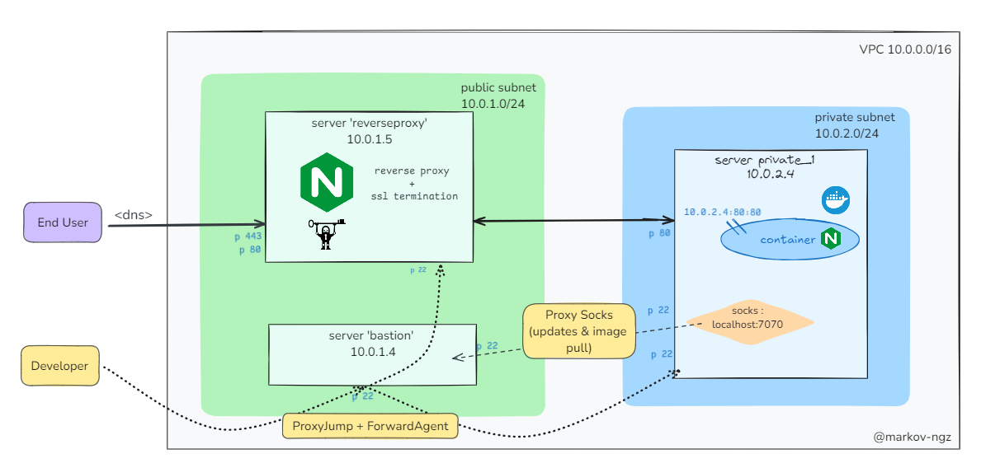

# auto_reverseproxy_docker
Automatic setup of a reverse proxy server with SSL termination, a docker server and a 'factice' bastion host 
## Executive summary schema 


## Prerequisites
0. Having an AWS 53 hosted zone with a dns and terraform + ansible on your local machine 
1. Create 2 keys (one for AWS and another to connect as non sudo) 
```
ssh-keygen -t rsa -b 2048 -f <filename>
```
2. Setup ssh agent (needed to provide internet access for private instances)
```
eval `ssh-agent`
ssh-add <path>
```
3. Set the following environment variables ( terraform & variables)
```
export TF_VAR_user_name=
export USER_PUBLIC_KEY=
export TF_VAR_user_private_key=
export TF_VAR_ec2_private_key= 
export TF_VAR_ec2_public_key=
export TF_VAR_public_ip=$(curl -s ifconfig.me)
export TF_VAR_key_name=
export TF_VAR_dns_name=
```
## Infrastructure 
0. (Optional) setup the following env to match your plugin path in order to avoid to download the plugin
```
export TF_PLUGIN_CACHE_DIR=<plugin_path>
```
1. Run terraform scripts
```
terraform init
terraform apply -auto-approve
```
A config file should be written in the ansible directory, it will be referenced and used by ansible
## Configuration
Run ansible 
```
ansible-playbook -i inventory.yml playbook.yml
```
## Check success
Go to your dns and check if at the /api you have the nginx default front page 

## Possible improvement
- nginx reverse proxy template : a jinja 'for' loop can be setup in the upstream block in order to add round robin load balancing.

## Cite and share 
Please add the license to your work or add a star ✨ to the repository 😊 